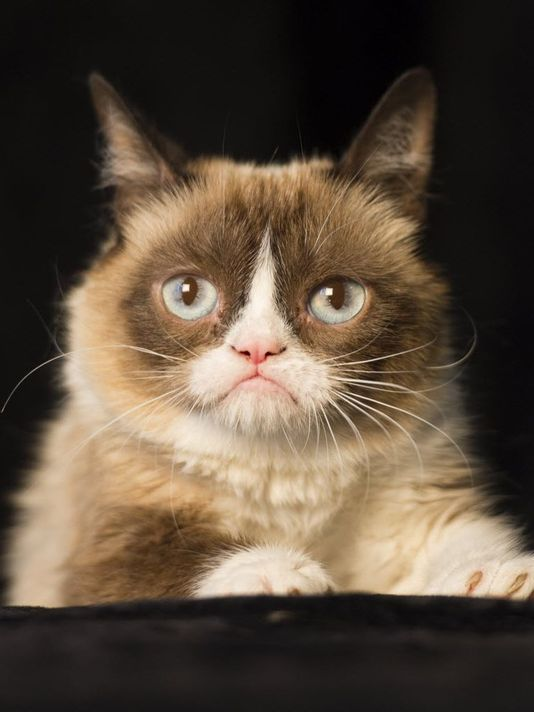
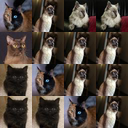

# meowsaic
Converts a given image into a mosaic made of cats.

| Input                                             | Output                                           |
| --------------------------------------------------| ------------------------------------------------ |
|  |  |
| 1 cat                                             | 27,649 cats                                      |

## Requirements
```
Pillow
progress
```

## Usage
```
python3 meowsaic.py <inputImagePath> <outputImagePath> [quality]

Quality determines the number of pixels per cat picture.
Must be 1 (16x16), 2 (32x32), or 3 (64x64).
Defaults to 3 if not provided.
```

## Quality
| 1                                        | 2                                         | 3                |
| ------------------------------------------ | ---------------------------------------------- | ------------------- |
|  |   |  |

# Acknowledgements
* Method for determining closest-matching RGB value was adapted from Lasse Vågsæther Karlsen's and Quantic's answer to this stackoverflow question: https://stackoverflow.com/questions/1847092/given-an-rgb-value-what-would-be-the-best-way-to-find-the-closest-match-in-the-d
